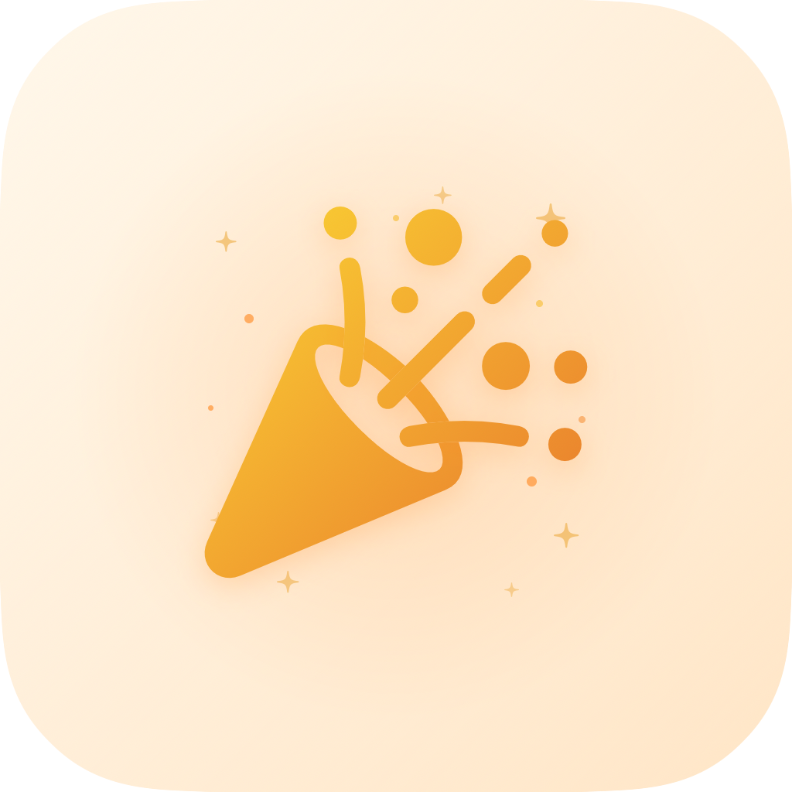

# 🎉 Slavíme

> Osobní iOS aplikace pro sledování svátků a narozenin — nikdy nezapomeň pogratulovat.

<p align="center">
  
</p>

---

## O aplikaci

**Slavíme** je minimalistická iOS appka pro lidi, kteří chtějí mít přehled o svátcích a narozeninách svých blízkých — bez zbytečného složitého nastavování.

Přidáš jméno, appka automaticky najde svátek z českého kalendáře, nastaví připomínky a propíše vše do iOS Kalendáře. Žádné cloudové účty, žádné sdílení dat — vše zůstává na tvém telefonu.

---

## Funkce

- 📅 **Automatická detekce svátků** z českého kalendáře (365 jmen + přezdívky)
- 🎂 **Narozeniny** s výpočtem věku
- 🇨🇿 **Státní svátky ČR** včetně pohyblivých Velikonoc
- 🔔 **Push notifikace** — den před, v den události
- 🎁 **Připomínka dárku** s interaktivními akcemi (mám dárek / připomenout znovu / nekupuju nic)
- 📆 **Synchronizace s iOS Kalendářem** — roční opakující se události
- 📸 **Foto nebo emoji** avatar pro každou osobu
- 🌙 **Dark mode** podpora včetně adaptivní ikony
- 🔭 **Kalendářní prohlížeč** svátků s barevným označením
- ♈ **Znamení zvěrokruhu** pro aktuální den

---

## Technologie

| | |
|---|---|
| **Jazyk** | Swift 5.9 |
| **UI** | SwiftUI |
| **Persistence** | SwiftData |
| **Notifikace** | UserNotifications |
| **Kalendář** | EventKit |
| **Minimální iOS** | 17.0 |

---

## Instalace (lokální build)

1. Naklonuj repozitář
```bash
git clone https://github.com/lukascervenka1/slavime-ios.git
cd slavime-ios
```

2. Otevři projekt v Xcode
```bash
open Svatek.xcodeproj
```

3. Vyber svůj tým v **Signing & Capabilities**

4. Spusť na simulátoru nebo fyzickém zařízení (⌘+R)

---

## Snímky obrazovky

_Připravujeme — aplikace bude brzy dostupná v App Store._

---

## Ochrana osobních údajů

Veškerá data jsou uložena výhradně lokálně na zařízení uživatele. Aplikace nesbírá, neodesílá ani nesdílí žádné osobní údaje.

📄 [Zásady ochrany osobních údajů](https://lukascervenka1.github.io/slavime-ios/privacy-policy.html)

---

## Autor

<table>
  <tr>
    <td align="center">
      <strong>Lukáš Červenka</strong><br/>
      <a href="https://aimplementace.cz">aimplementace.cz</a><br/>
      <a href="mailto:gandy.lucas@gmail.com">gandy.lucas@gmail.com</a>
    </td>
  </tr>
</table>

Vytvořeno pod hlavičkou **[Aimplementace.cz](https://aimplementace.cz)** — implementace AI řešení pro firmy.

---

## Licence

Copyright © 2026 Lukáš Červenka / Aimplementace.cz. Všechna práva vyhrazena.
